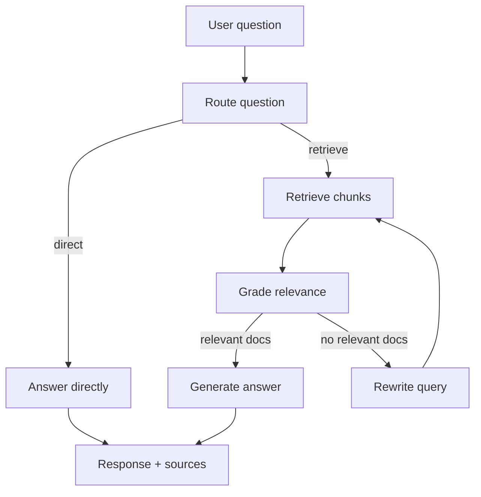

# Agentic RAG

An adaptive retrieval-augmented generation system built with **LangGraph**, **FAISS**, and **OpenAI**. The agent decides when to retrieve, grades document relevance, rewrites queries when needed, and generates grounded answers with source citations.

## Architecture



## Features

- **Adaptive routing** — skips retrieval for greetings and general questions
- **Document grading** — filters irrelevant chunks before generation
- **Query rewriting** — retries retrieval with a refined query (up to 2 times)
- **CLI + REST API** — ingest, query, and serve from the same codebase
- **Multi-format ingestion** — `.txt`, `.md`, and `.pdf`

## Setup

```bash
cd ~/Projects/agentic-rag
python -m venv .venv
source .venv/bin/activate
pip install -e .
cp .env.example .env   # add your OPENAI_API_KEY
```

## Usage

### Ingest documents

```bash
agentic-rag ingest sample_docs
```

Clear and re-index:

```bash
agentic-rag ingest sample_docs --reset
```

### Query via CLI

```bash
agentic-rag query "What is the refund policy?"
agentic-rag query "Hello!"
```

### Start the API

```bash
agentic-rag serve
```

Endpoints:

| Method | Path | Description |
|--------|------|-------------|
| GET | `/health` | Health check |
| GET | `/stats` | Indexed chunk count |
| POST | `/ingest` | `{"path": "sample_docs", "reset": false}` |
| POST | `/query` | `{"question": "What are support hours?"}` |

Example:

```bash
curl -X POST http://127.0.0.1:8000/query \
  -H "Content-Type: application/json" \
  -d '{"question": "How long does standard shipping take?"}'
```

## Configuration

Environment variables (see `.env.example`):

| Variable | Default | Description |
|----------|---------|-------------|
| `OPENAI_API_KEY` | — | Required |
| `OPENAI_MODEL` | `gpt-4o-mini` | Chat model |
| `OPENAI_EMBEDDING_MODEL` | `text-embedding-3-small` | Embeddings |
| `VECTOR_INDEX_DIR` | `./data/index` | FAISS index path |
| `CHUNK_SIZE` | `1000` | Chunk size in characters |
| `RETRIEVAL_TOP_K` | `4` | Chunks retrieved per query |

## Project layout

```
src/agentic_rag/
  agent/       LangGraph workflow (route → retrieve → grade → generate)
  ingestion/   Document loading and chunking
  retrieval/   FAISS vector index
  api/         FastAPI server
  cli/         Typer CLI
```

## License

MIT
